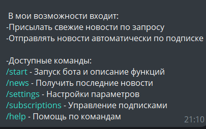
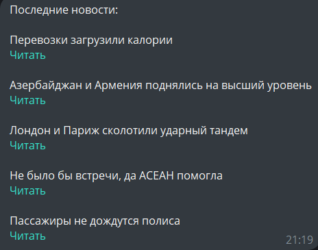
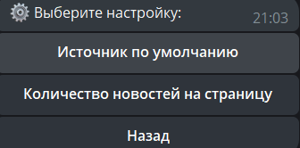
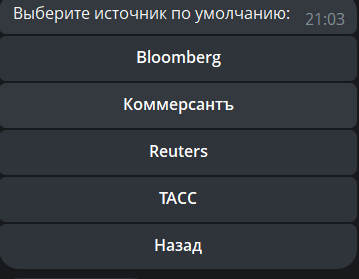

# Telegram News 

## Основные функции

- Получение последних новостей по команде `/news`
- Подписка на автоматические обновления из выбранных источников
- Настройка источников по умолчанию и количества новостей
- Сохранение данных в базе данных PostgreSQL
- Поддержка 4 новостных источников:
  - Bloomberg
  - Коммерсантъ
  - Reuters
  - ТАСС

## Технологии

- Python 3.11
- PostgreSQL
- python-telegram-bot
- BeautifulSoup4
- Requests

## Установка и настройка

### Предварительные требования

1. Установите [Python 3.11+](https://www.python.org/downloads/)
2. Установите [PostgreSQL](https://www.postgresql.org/download/)
3. Создайте Telegram-бота через [@BotFather](https://t.me/BotFather) и получите токен

1. Клонируйте репозиторий (или скачайте файлы проекта):
```bash
git clone https://github.com/MursikVar/FinishTestWork.git
cd FinishTestWork
```
2. Установка зависимостей:
```bash
pip install -r requirements.txt
```
3. Импорт схемы БД:
```bash
psql -U news_bot -d news_aggregator -f schema.sql
```
4. Запуск бота(через терминал):
```bash
python bot.py
```




